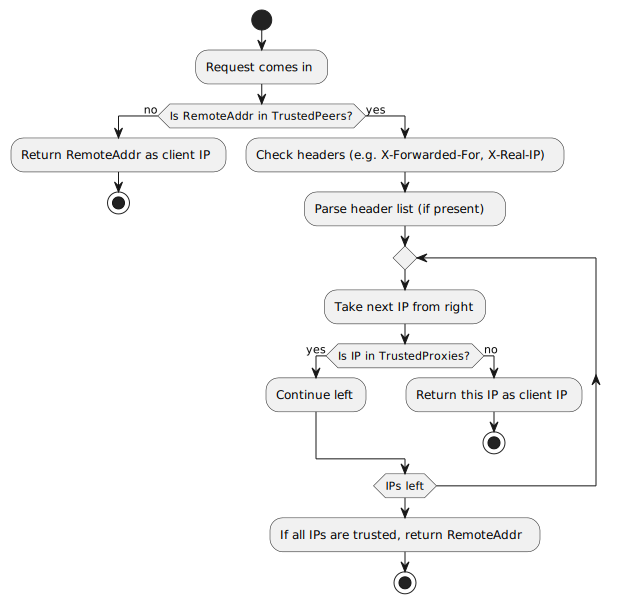

# realip

Determine the client IP address by inspecting HTTP request headers behind a proxy.

## How it works



## Usage

By default, `FromRequest()` returns the remote address without checking headers.

```go
var rip = realip.New()

func handler(w http.ResponseWriter, r *http.Request) {
    clientIP := rip.FromRequest(r)
}
```

You can configure which headers to check and which peers to trust.

```go
privateLAN, _ := netip.ParsePrefix("10.0.0.0/8")

var rip = realip.New(
    realip.WithHeaders([]string{realip.XForwardedFor, realip.XRealIP}),
    realip.WithTrustedPeers([]netip.Prefix{privateLAN}),
)
```

## Options

### WithHeaders

Specifies which HTTP headers to check for client IP addresses, in order of preference.

```go
realip.WithHeaders([]string{realip.XForwardedFor, realip.XRealIP})
```

Common headers: `X-Forwarded-For`, `X-Real-IP`, `True-Client-IP`

### WithTrustedPeers

Defines which IP ranges are allowed to set forwarding headers.

When `TrustedPeers` is set, headers are only checked if the request comes from a trusted peer. Otherwise, the remote address is returned.

```go
realip.WithTrustedPeers([]netip.Prefix{proxyNetwork})
```

**Required for security**: Only requests from these IPs will have their headers trusted.

### WithTrustedProxies

Specifies IP ranges of internal proxies that should be skipped when parsing the forwarding chain.

Used when you have multiple internal proxies and need to find the first external IP.

```go
realip.WithTrustedProxies([]netip.Prefix{privateLAN})
```

For example, with `X-Forwarded-For: 203.0.113.195, 10.0.0.3, 10.0.0.4`, this skips `10.0.0.3` and `10.0.0.4` to return `203.0.113.195`.

### WithProxyCnt

Sets the exact number of proxy hops to skip from the end of the forwarding chain.

If you know there are exactly N proxies in your chain, use `ProxyCnt` to skip them.

```go
var rip = realip.New(
    realip.WithHeaders([]string{realip.XForwardedFor}),
    realip.WithProxyCnt(1),
    realip.WithTrustedPeers([]netip.Prefix{proxyNetwork}),
)
```

With `X-Forwarded-For: 203.0.113.195, 70.41.3.18, 150.172.238.178`, this skips the last IP and returns `70.41.3.18`.

## Examples

### Single Proxy (nginx, HAProxy)

```go
proxyNetwork, _ := netip.ParsePrefix("10.0.0.0/24")

var rip = realip.New(
    realip.WithHeaders([]string{realip.XForwardedFor, realip.XRealIP}),
    realip.WithTrustedPeers([]netip.Prefix{proxyNetwork}),
)
```

### Cloudflare

Cloudflare sends the real client IP in the `True-Client-IP` header.

```go
cloudflareRange, _ := netip.ParsePrefix("173.245.48.0/20")

var rip = realip.New(
    realip.WithHeaders([]string{realip.TrueClientIP, realip.XForwardedFor}),
    realip.WithTrustedPeers([]netip.Prefix{cloudflareRange}),
)
```
